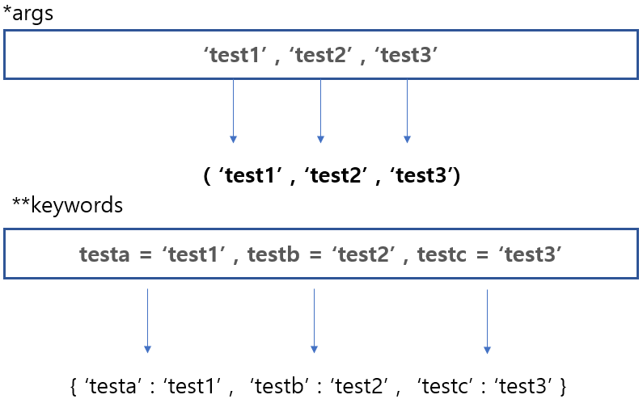

# def

def 라는 키워드는 함수를 정의할 때 시작합니다.
### 함수 정의하기

```py
>>> def hello():
...     print('helloworld')
...
>>> hello()
helloworld
```

위의 코드는 def 키워드로 hello 라는 함수를 정의하며
해당 hello 함수에 print 함수로 helloworld 를 출력하게 만들어져있고

hello() 함수를 호출 시 helloworld를 출력한다.

### 함수 인자 받기

```py
>>> def factorial(variable):
...     print(variable)
...
>>> factorial('helloworld')
helloworld
```

factorial 함수를 정의하면서 variable이라는 매개변수로 인자를 받아

vriable 변수를 출력한다.

### 기본 인자 값

```py
>>> def factorial(hello = 'hello'):
...     print(hello)
...
>>> factorial('world')
world
>>> factorial()
hello
```

factorial 이라는 함수에 hello이란 매개변수의 기본값이 'hello'로 정의되어있기 때문에

hello 변수에 인자를 안 넣어도 hello 가 출력된다.

```py
>>> def ListVariable(hello = []):
...     print(hello)
...
>>> ListVariable([1,2,3,4])
[1, 2, 3, 4]
>>> ListVariable()
[]
>>> def ListVariable(hello = []):
...     print(hello)
...     print(type(hello))
...
>>> ListVariable()
[]
<class 'list'>
```

위의 코드는 ListVariable 함수에 hello 매개변수를 list 형으로 기본값을 정의하고

밑의 함수를 다시 재정의하고 type(hello)를 추가했더니

기본값으로 list 타입으로 되어있는 것을 볼 수 있다.

### 특수 매개변수

```py
>>> def SpecialVariable(*args, **keywords):
...     for argsVariable in args:
...             print(argsVariable)
...     for key in keywords:
...             print(key," -> ",keywords[key])
...     print(type(args))
...     print(type(keywords))
...     print(args)
...     print(keywords)
...
>>> SpecialVariable('a','b','c',a = 'a',b = 'b',c = 'c')
a
b
c
a  ->  a
b  ->  b
c  ->  c
<class 'tuple'>
<class 'dict'>
('a', 'b', 'c')
{'a': 'a', 'b': 'b', 'c': 'c'}
```

*args 는 tuple 형이고
**keywords는 dict 형으로 기본 정의된다.

'a','b','c' 는 *args 변수에 들어가고
a = 'a' , b = 'b' , c = 'c' 는 **keywords 변수게 들어가게 된다.

전달되는 방식을 이미지로 본다면

<br>



이런 식으로 전달된다.

### 특수 매개 변수

특수 키워드로 인자 전달될 때 방법을 제한하여 가동성과 성능을 늘릴 수 있습니다.

#### / keyword 제한

```py
>>> def one( a , / ):
...     print(a)
...     print(type(a))
...
>>> one('1')
1
<class 'str'>
>>> one(a = '1')
Traceback (most recent call last):
  File "<stdin>", line 1, in <module>
TypeError: one() got some positional-only arguments passed as keyword arguments: 'a'
```

one 함수에서 매개변수 a에 keywords 제한을 두고 정의했다.

인자를 전달할 때 Positional(위치)로 값을 전달하여야 한다.

one('1')에서 a의 위치에 '1' 변수를 전달하고

one(a = '1')에서는 keywords 형식으로 '1'을 전달하더니 

```
Traceback (most recent call last):
  File "<stdin>", line 1, in <module>
TypeError: one() got some positional-only arguments passed as keyword arguments: 'a'
```

위와 같이 에러가 나는 것을 확인할 수 가 있다.

에러가 나지않고 올바을 형식으로 인자로 전달하기위해서 Postitional 위치로 전달해야된다.

그리고 인자 생성할 때 
```py
def <원하는 변수 이름>(<원하는 인자 이름>, / ):
```

이런식으로 하면 된다.

#### * Positional 제한

```py
>>> def one( * , a ):
...     print(a)
...     print(type(a))
...
>>> one('1')
Traceback (most recent call last):
  File "<stdin>", line 1, in <module>
TypeError: one() takes 0 positional arguments but 1 was given
>>> one(a = '1')
1
<class 'str'>
```

새로 one 함수 정의할때 a 매개변수를 Positional 제한시켰다.

이처럼 a 변수에 위치로 전달하는것이 아닌

keyword 형식으로 

one(a = '1') 같이 전달해야된다.

그래서 one('1') 이렇게 전달하면 

```py
Traceback (most recent call last):
  File "<stdin>", line 1, in <module>
TypeError: one() takes 0 positional arguments but 1 was given
```

이렇게 에러가 발생하는 것을 볼 수 가있다.

### return 리턴

__return 은 정의한 함수에서 반환하는 값이라고 생각하면 된다.__

```py
def <원하는 함수 이름>(<받을 인자>):
    <코드 처리>
    return <반환하고싶은 변수 또는 값>
```

위처럼 정의하면은 된다.

```py
>>> def ReturnFunc(sum_one , sum_two):
...     num = sum_one + sum_two
...     return num
...
>>> result = ReturnFunc(20,5)
>>> print(result)
25
>>> print(ReturnFunc(20,5))
25
```

ReturnFunc 함수는 인자 1 과 인자 2 를 받아

합을 한 값을 리턴한다.

```py
result = ReturnFunc(20,5)
```

아니면

```py
print(ReturnFunc(20,5))
```

이렇게 정의해도 무방하다.

그리고 return하는 과정에서 연산을 해도 상관없다.

위의 코드를 최적화 시킨다면

```py
def ReturnFunc(sum_one , sum_two):
    return sum_one + sum_two
```

이런식으로 선언하면 가독성이 좋아직호 코드가 좀 더 최적화 된다.

```py
>>> def ReturnFunc(sum_one , sum_two):
...     return sum_one + sum_two
...
>>> result = ReturnFunc(20,5)
>>> print(result)
25
>>> print(ReturnFunc(20,5))
25
```

전 코드처럼 함수를 호출해도 기능은 똑같다.

### 마무리

python 공직 자료 링크

[python notice link](https://docs.python.org/ko/3/tutorial/controlflow.html#defining-functions)
