# Cheat Engine Tutorial

### Contents

+ ##### __Step__ 2

+ ##### __Step__ 3

+ ##### __Step__ 4

+ ##### __Step__ 5

+ ##### __Step__ 6

+ ##### __Step__ 7

+ ##### __Step__ 8

+ ##### __Step__ 9

+ ##### __Step__ 10

### Step 2

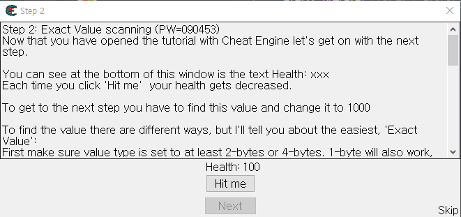

Step 2 문제를 분석해보자면 Hit me 버튼을 누르면 Health : 100 이 점점 줄어진다.

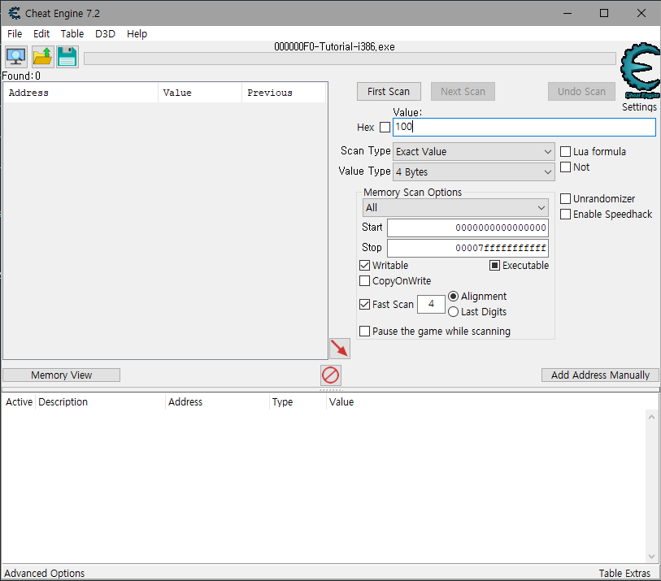

치트엔진에서 First Scan 을 이용하여 Value 에 입력되어있는 값을 찾는다.

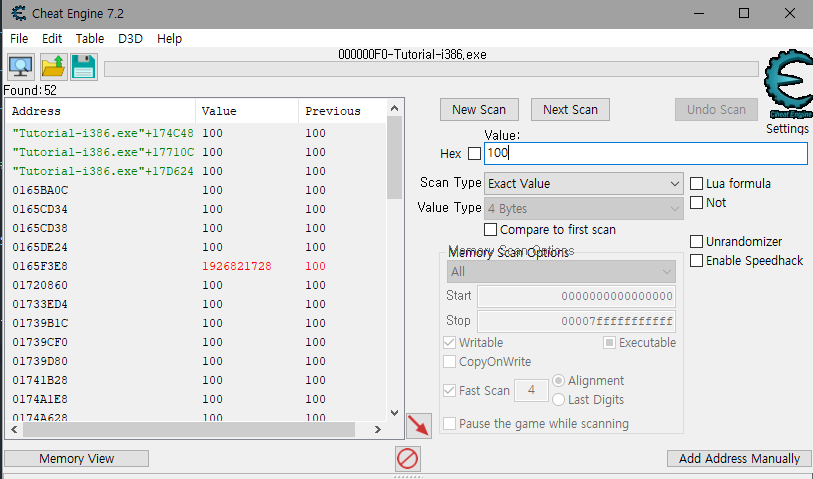

그러면 이렇게 수 많은 값들과 메모리 주소가 나오게되는데 

수 많은 값들중 내가 찾고있는 값을 찾고 싶다면

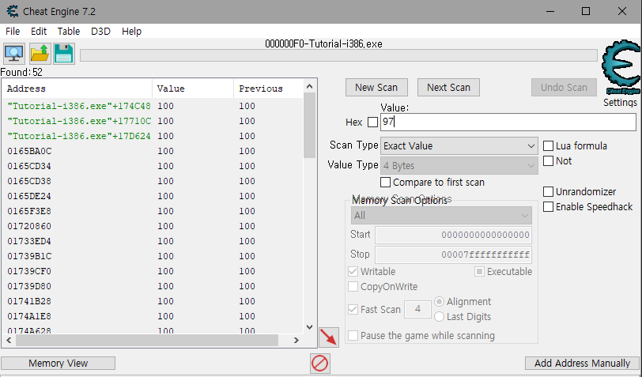

Hit me 버튼을 한번 눌러서 값을 변동시킨다음에

변경되어있는 값을 Value 에 입력 후 Next Scan 버튼을 누른다면

100 -> 97로 변경된 값을 찾을 수 있다.

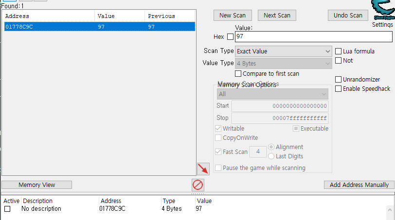

그러면 위의 사진처럼 하나의 값이 나올텐데 저거를 더블클릭하면

하단으로 메모리 주소 , 타입 , 값이 나오게된다.

그런 다음 Value 부분을 더블클릭하여 

1000으로 변경을 하면은

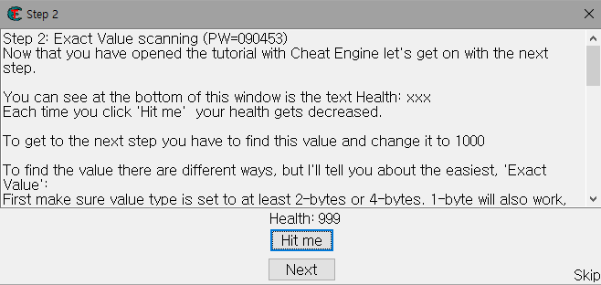

이런식으로  Next 버튼이 활성화되면서 다음 단계로 넘어갈 수 있다.

### Step 3

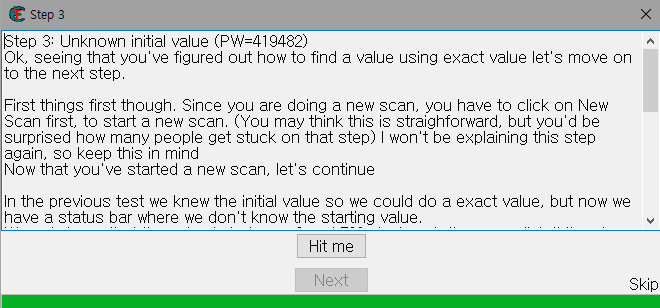

Step 3 를 분석해보면 Hit me 를 누르면 밑의 초록색 바가 줄어지면서 Hit me 버튼 밑에 숫자가 나오는것을 볼 수 있다.

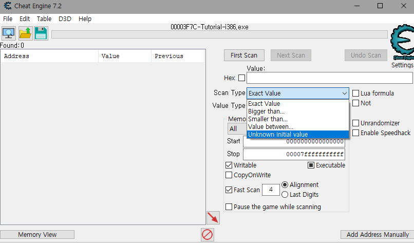

먼저 프로그램을 잡은 다음에 

__Unknown initial value__

Scan Type로 설정하고 First Scan 버튼을 누르면

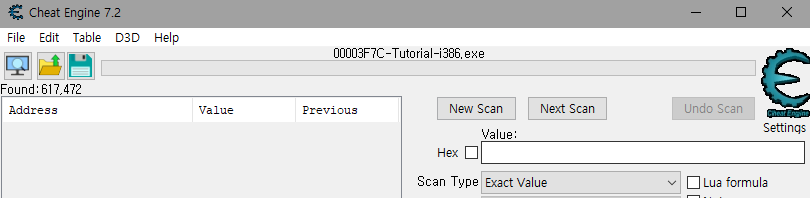

좌측을 살펴보면 Found: 617,472가 나오는데

Found 는 즉 모든 값을 스캔한 값이다.

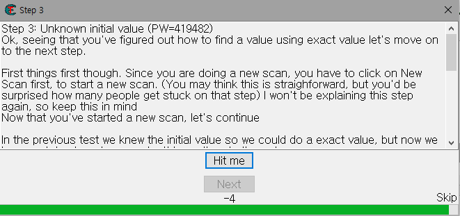

이제 Hit me 버튼을 누른 다음에 밑에 -4 라고 나온것을 볼 수 있는데

해당 값을

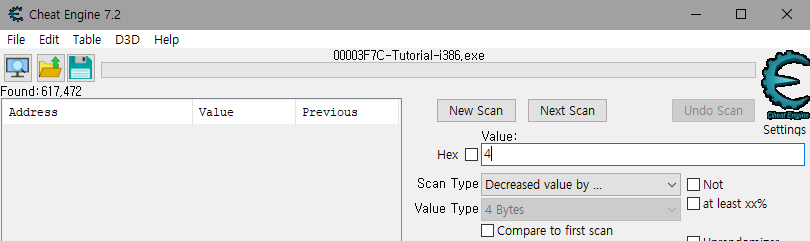

Scan Type 를 __Decreased value by__ 로 변경한 다음 Value에 아까 -4 로 나왔기때문에 4를 넣으면 된다.

즉 __Decreased value by__ 는 value 만큼 감소된거를 체크한다.

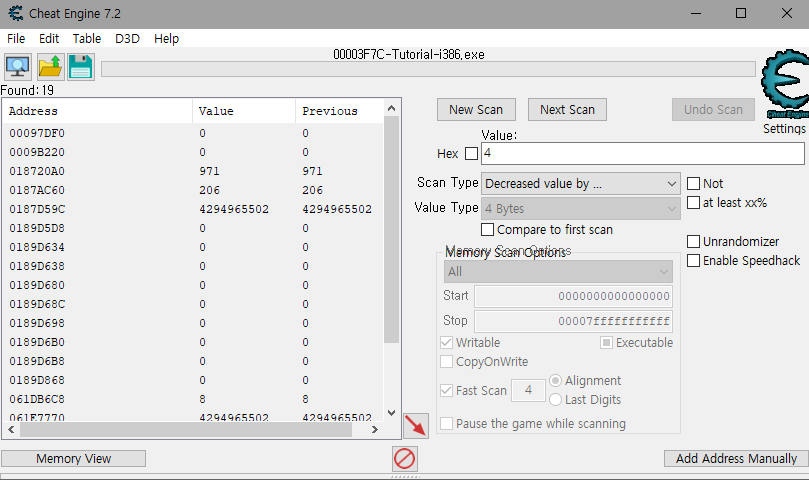

하지만 위의 사진처럼 19개나 나온것을 볼 수 있다.

우리가 원하는 값만 체크하기 위해서는 방금처럼

Hit me 버튼 누르고 -n 된 값을 __Decreased value by__ 로 변경한 다음 Found 개수가 최대로 줄어질때 까지 반복해준다.

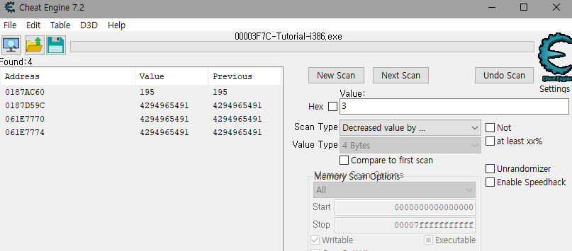

계속 하다보면 4개가 계속 유지되는것을 볼 수 있다.

이제 우리가 변경해야되는 값은 맨 위에있는 0187AC60 주소의 value 195 인거를 더블클릭 한 다음에 value 를 5000으로 변경해 주면 Netx 버튼이 활성화된것을 볼 수 있다.

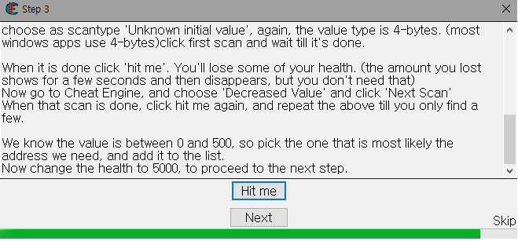

### Step 4